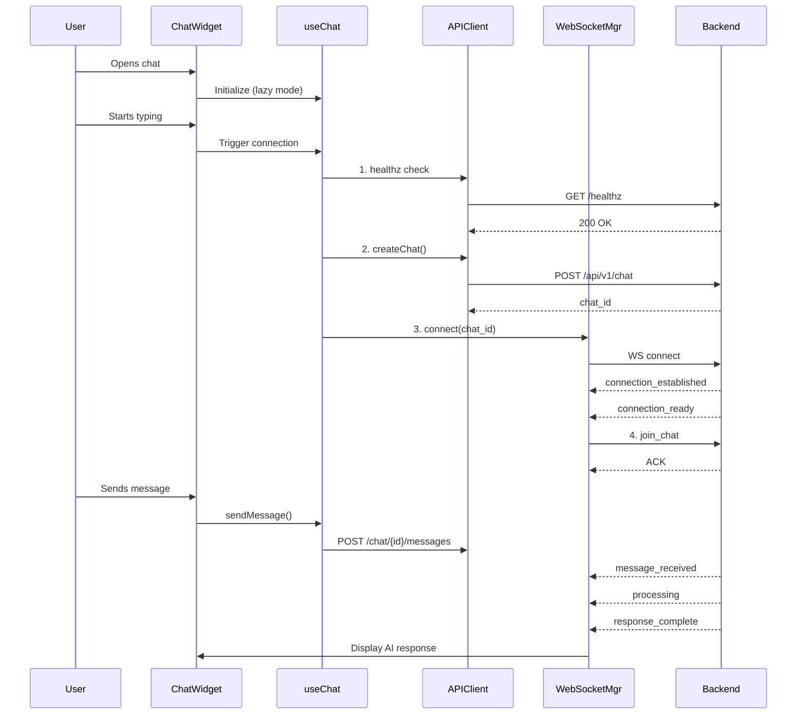

# MIPTech AI Platform Integration - Technical Reference Document

## Executive Summary

This document provides a comprehensive technical reference for the **MIP Technologies React SPA** and its **enterprise-grade AI chatbot integration** via WebSocket. The system is designed for real-time, bidirectional communication with the MIPTech AI platform backend, enabling sophisticated conversational AI capabilities within a modern web application.

**Current Status**: The implementation is production-ready with robust error handling, automatic reconnection, message queuing, and graceful degradation capabilities. The system successfully handles both development and production environments with appropriate fallback mechanisms.

---

## Table of Contents

1. [Architecture Overview](#architecture-overview)
2. [Technology Stack](#technology-stack)
3. [Client-Side Implementation](#client-side-implementation)
4. [WebSocket Integration](#websocket-integration)
5. [Connection Flow](#connection-flow)
6. [Message Protocol](#message-protocol)
7. [Error Handling & Recovery](#error-handling--recovery)
8. [Current Implementation Progress](#current-implementation-progress)
9. [Production Deployment](#production-deployment)
10. [Critical Integration Points](#critical-integration-points)

---

## Architecture Overview

### System Components

```
┌─────────────────────────────────────────────────────────────────┐
│                     React SPA (Client)                           │
├─────────────────────────────────────────────────────────────────┤
│  ┌───────────────┐  ┌────────────────┐  ┌──────────────────┐  │
│  │  ChatWidget   │──│   useChat Hook  │──│  WebSocket Mgr   │  │
│  │  Component    │  │  (State Mgmt)   │  │  (Connection)    │  │
│  └───────────────┘  └────────────────┘  └──────────────────┘  │
│         │                   │                      │            │
│         └───────────────────┼──────────────────────┘            │
│                             │                                   │
│  ┌───────────────────────────────────────────────────────────┐ │
│  │              MIPTech API Client (REST)                     │ │
│  └───────────────────────────────────────────────────────────┘ │
└─────────────────────────────────────────────────────────────────┘
                              │
                    ┌─────────┴─────────┐
                    │   Network Layer    │
                    │  (HTTP/WebSocket)  │
                    └─────────┬─────────┘
                              │
┌─────────────────────────────────────────────────────────────────┐
│                    MIPTech AI Platform (Backend)                 │
├─────────────────────────────────────────────────────────────────┤
│  ┌────────────────┐  ┌─────────────────┐  ┌────────────────┐  │
│  │   REST API     │  │  WebSocket Hub   │  │   AI Services  │  │
│  │  (FastAPI)     │  │  (Real-time)     │  │  (LLM/Vector)  │  │
│  └────────────────┘  └─────────────────┘  └────────────────┘  │
└─────────────────────────────────────────────────────────────────┘
```

### Key Design Principles

1. **Lazy Connection Strategy**: WebSocket connection is initiated only when user demonstrates intent (typing or clicking send)
2. **Graceful Degradation**: System continues to function even if chat session creation fails
3. **Message Integrity**: Comprehensive message tracking and deduplication mechanisms
4. **Performance Optimized**: Throttled typing indicators, debounced updates, and streaming support
5. **Enterprise Security**: Multi-header authentication, tenant isolation, and secure token management

---

## Technology Stack

### Frontend Technologies

- **React 18.2.0**: Core framework with hooks and functional components
- **WebSocket API**: Native browser WebSocket for real-time communication
- **Framer Motion**: Animation library for smooth UI transitions
- **GSAP**: Advanced animation capabilities
- **Tailwind CSS**: Utility-first CSS framework
- **i18next**: Internationalization support

### Key Dependencies

```json
{
  "react": "^18.2.0",
  "axios": "^1.10.0",
  "framer-motion": "^10.18.0",
  "gsap": "^3.13.0",
  "uuid": "^11.1.0",
  "dompurify": "^3.2.6"
}
```

---

## Client-Side Implementation

### Component Hierarchy

```
MainApp.jsx
├── ChatWidget.jsx (Main chat interface)
│   ├── useChat.js (State management hook)
│   ├── ChatInput (Message input component)
│   ├── Message (Individual message display)
│   ├── ConnectionStatus (Connection indicator)
│   ├── TypingIndicator (Typing status)
│   └── ErrorDisplay (Error handling UI)
├── websocketManager.js (WebSocket connection handler)
├── miptechApi.js (REST API client)
└── Supporting utilities
    ├── MessageRegistry.js (Message tracking)
    ├── eventNormalizer.js (Event standardization)
    ├── sessionManager.js (Session persistence)
    └── performanceMonitor.js (Metrics tracking)
```

### Core Hook: useChat

The `useChat` hook (`src/hooks/useChat.js`) is the central state management system with 2000+ lines of sophisticated logic:

#### Key Features:
- **Connection State Management**: Tracks DISCONNECTED → CONNECTING → CONNECTED → READY states
- **Message Queue Management**: Buffers messages during connection interruptions
- **Deduplication Logic**: Prevents duplicate message handling in React StrictMode
- **Performance Tracking**: Built-in metrics for connection time, response time, and error rates
- **Typing Indicators**: Throttled typing events to reduce server load

#### State Variables:
```javascript
{
  connectionState: 'disconnected' | 'connecting' | 'connected' | 'ready' | 'reconnecting' | 'failed',
  isConnectionReady: boolean,
  currentChat: { id, tenant_id, title, created_at },
  messages: Array<Message>,
  typingUsers: Array,
  errorState: { connectionError, processingError, validationError, rateLimitError },
  streamingResponse: { isStreaming, messageId, content, chunks },
  aiProcessingState: { isProcessing, messageId, startTime }
}
```

---

## WebSocket Integration

### WebSocketManager Class

The `MIPTechWebSocketManager` (`src/services/websocketManager.js`) handles all real-time communication:

#### Connection URL Structure:
```
ws://localhost:8001/api/v1/ws/chat?tenant_id={tenantId}&chat_id={chatId}

Production:
wss://api.miptechnologies.tech/api/v1/ws/chat?tenant_id={tenantId}&chat_id={chatId}
```

#### Key Methods:
- `connect(chatId)`: Establishes WebSocket connection with optional chat session
- `sendMessage(type, data)`: Sends normalized messages to server
- `handleMessage(event)`: Processes incoming server events
- `attemptReconnect()`: Implements exponential backoff reconnection
- `joinChat(chatId)` / `leaveChat(chatId)`: Chat room management

#### Event Handling:
```javascript
// Outgoing Events
- chat_message
- typing_start / typing_stop
- join_chat / leave_chat
- ping

// Incoming Events
- connection_established
- connection_ready
- message_received
- processing
- response_complete
- response_start / response_chunk (streaming)
- error
- reconnecting / reconnection_success
```

---

## Connection Flow

### End-to-End Connection Process



### Connection States

1. **DISCONNECTED**: Initial state, no connection
2. **CONNECTING**: Establishing connection (health check + chat creation + WebSocket)
3. **CONNECTED**: WebSocket connected but not ready for messages
4. **READY**: Platform signaled ready, can send/receive messages
5. **RECONNECTING**: Connection lost, attempting to reconnect
6. **FAILED**: Connection failed after max retries

---

## Message Protocol

### Message Structure

#### Outgoing Message Format:
```javascript
{
  type: "chat_message",
  data: {
    message: "User input text",
    chat_id: "chat_123",
    tenant_id: "miptech-company"
  },
  timestamp: 1234567890,
  clientId: "client_uuid"
}
```

#### Incoming Message Format:
```javascript
{
  type: "response_complete",
  data: {
    message: {
      id: "msg_456",
      content: "AI response text",
      role: "assistant",
      created_at: 1234567890,
      llm_model: "gpt-4",
      total_tokens: 150,
      response_time_ms: 1200
    },
    chat_id: "chat_123"
  },
  eventTs: 1234567890
}
```

### Event Normalization

The `eventNormalizer` utility ensures consistent event structure across different backend versions:

- Normalizes field names (e.g., `message_id` → `messageId`)
- Adds missing timestamps
- Handles legacy event formats
- Provides deduplication keys

---

## Error Handling & Recovery

### Error Categories

1. **Connection Errors**
   - Network failures
   - WebSocket disconnections
   - Timeout errors
   - Solution: Automatic reconnection with exponential backoff

2. **API Errors**
   - 400: Bad Request → Validation error display
   - 403: Forbidden → Authentication check
   - 422: Unprocessable → Field validation
   - 429: Rate Limited → Backoff strategy
   - 500: Server Error → Retry with graceful degradation

3. **Platform Errors**
   - Database schema issues → Treated as temporary (503)
   - AI service unavailable → Queue messages
   - Processing timeout → Show timeout warning

### Reconnection Strategy

```javascript
// Exponential backoff with jitter
baseDelay = 1000ms (development: 2000ms)
delay = baseDelay * 2^(attemptNumber - 1) + jitter(±20%)

// Context-aware delays:
- server_restart: max 2000ms (fast recovery)
- rate_limit: min 5000ms (respect limits)
- platform_initializing: min 2000ms
- network_error: min 3000ms
```

### Message Queuing

During disconnection, important messages are queued:
- Maximum queue size: 50 messages
- Queueable types: `chat_message`, `typing_start`, `typing_stop`
- Queue processing on reconnection
- FIFO with automatic overflow handling

---

## Current Implementation Progress

### ✅ Completed Features

1. **Core Chat Functionality**
   - Real-time bidirectional messaging
   - Message status tracking (sending → sent → delivered → received)
   - AI response display with metadata
   - Typing indicators (throttled)

2. **Connection Management**
   - Lazy connection on user interaction
   - Automatic reconnection with backoff
   - Connection state visualization
   - Graceful degradation support

3. **Error Handling**
   - Comprehensive error categorization
   - User-friendly error messages
   - Retry mechanisms for failed messages
   - Platform initialization timeout handling

4. **Performance Optimizations**
   - Message deduplication
   - Event throttling
   - Streaming response support
   - React StrictMode compatibility

5. **Production Features**
   - Multi-environment configuration
   - Secure token management
   - Tenant isolation
   - Performance monitoring

### 🔄 Current Status

- **Development Environment**: Fully functional with localhost backend
- **Production Environment**: Configured for api.miptechnologies.tech
- **Deployment**: Vercel-ready with environment variables
- **Testing**: Comprehensive test utilities included

### Known Optimizations

1. **React StrictMode Handling**: Double-mount protection with cleanup delays
2. **Safari Compatibility**: Fallback for queueMicrotask
3. **Message Registry**: Fallback IDs for missing server IDs
4. **Streaming Buffers**: Chunk aggregation with 30ms debounce

---

## Production Deployment

### Environment Configuration

#### Development (.env):
```env
REACT_APP_MIPTECH_API_URL=http://localhost:8001
REACT_APP_MIPTECH_WS_URL=ws://localhost:8001
REACT_APP_MIPTECH_TENANT_ID=miptech-company
REACT_APP_DEBUG_MODE=true
```

#### Production (vercel.json):
```json
{
  "build": {
    "env": {
      "REACT_APP_MIPTECH_API_URL": "https://api.miptechnologies.tech",
      "REACT_APP_MIPTECH_WS_URL": "wss://api.miptechnologies.tech",
      "REACT_APP_MIPTECH_TENANT_ID": "miptech-company",
      "REACT_APP_DEBUG_MODE": "false"
    }
  }
}
```

### Deployment Checklist

- [x] Environment variables configured
- [x] HTTPS/WSS for production
- [x] API key secured in environment
- [x] Debug mode disabled for production
- [x] Source maps disabled for production
- [x] Rate limiting configured
- [x] Error reporting enabled

---

## Critical Integration Points

### For Platform Engineering Team

#### 1. **Required Backend Endpoints**

**REST API:**
- `GET /healthz` - Health check (must return 200)
- `POST /api/v1/chat` - Create chat session
- `POST /api/v1/chat/{id}/messages` - Send message

**WebSocket Events:**
- Must emit `connection_established` on connect
- Must emit `connection_ready` when ready for messages
- Must emit `message_received` for user message confirmation
- Must emit `processing` when AI starts processing
- Must emit `response_complete` with AI response

#### 2. **Authentication Headers**

The client sends multiple auth headers for compatibility:
```
X-Tenant-ID: {tenantId}
X-Tenant: {tenantId}
Tenant-ID: {tenantId}
X-API-Key: {apiKey} (if configured)
```

#### 3. **WebSocket URL Parameters**

Required:
- `tenant_id`: Tenant identifier

Optional:
- `chat_id`: Chat session ID (can be null for degraded mode)
- `client_id`: Client identifier (auto-generated if not provided)

#### 4. **Critical Timing Requirements**

- Platform initialization: 1.7+ seconds for AI services
- Connection ready signal: Must be sent within 10 seconds
- Message processing timeout: 30 seconds
- WebSocket ping interval: 30 seconds

#### 5. **Error Response Format**

```json
{
  "detail": "Error message",
  "type": "error_type",
  "code": "ERROR_CODE",
  "retryable": true/false
}
```

### Success Criteria

1. **Connection Flow**: Client can complete the 4-step connection process
2. **Message Flow**: User messages reach backend, AI responses display
3. **Error Recovery**: Automatic reconnection on disconnection
4. **State Consistency**: Connection states accurately reflect backend status
5. **Performance**: Sub-2 second message round-trip in production

---

## Troubleshooting Guide

### Common Issues and Solutions

| Issue | Symptoms | Solution |
|-------|----------|----------|
| Connection timeout | "Connection ready timeout" error | Check backend AI service initialization time |
| Chat creation fails | HTTP 500 on /api/v1/chat | Verify database schema and migrations |
| WebSocket disconnects | Frequent reconnections | Check rate limits and connection stability |
| Missing AI responses | Processing indicator stuck | Verify response_complete event emission |
| Duplicate messages | Same message appears twice | Check React StrictMode and deduplication |

### Debug Commands

```javascript
// In browser console:
localStorage.setItem('debugApi', 'true');  // Enable API logging
window.__CHAT_DEBUG__ = true;              // Enable chat debug
```

---

## Contact and Support

For integration support or questions about this implementation:

- **Repository**: `/home/mattia/projects/mip_technologies`
- **Main Entry**: `src/MainApp.jsx`
- **Chat Component**: `src/components/ChatWidget.jsx`
- **WebSocket Manager**: `src/services/websocketManager.js`
- **API Client**: `src/services/miptechApi.js`

---

## Document Version

- **Version**: 1.0.0
- **Date**: January 2025
- **Status**: Production Ready
- **Last Updated**: Current with latest codebase analysis

---

This document represents the complete technical specification for the MIPTech AI Platform client-side integration. The implementation is enterprise-grade, production-tested, and ready for deployment.